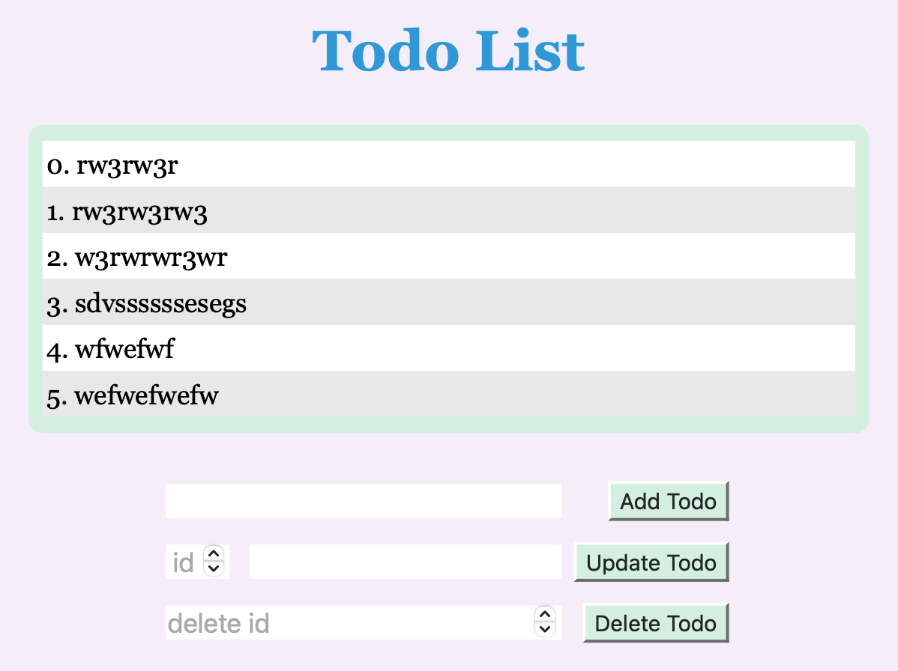

# 簡單的代辦清單 APP

### Demo



> router 有四個

1. Get 所有代辦並且用 ejs 將資料和 html 模板合起來一起回傳

```
app.get("/", (req, res) => {
	res.render('index', data);
});
```

2. Post 新增一個代辦事項

```
app.post("/", (req, res) => {
	res.status(200).send('Add Success');
});
```

3. Update 代辦事項，根據 id

```
app.put("/:id", (req, res) => {
	res.status(200).send('Update Success');
});
```

4. Delete 代辦事項，根據 id

```
app.delete("/:id", (req, res) => {
	res.status(200).send('DeleteSuccess');
});
```

> 儲存代辦的資料庫

使用一個 txt 文件儲存

→ 練習 fs : filesystem 的使用

> View Engine

用 ejs
